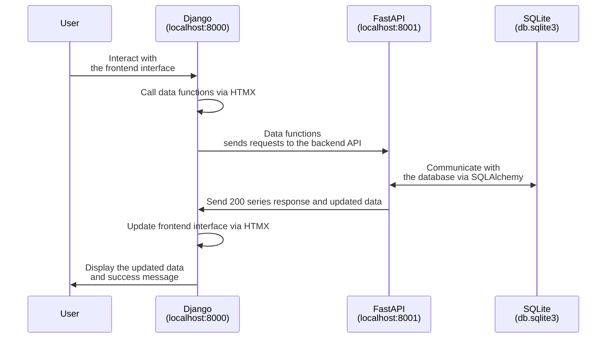

# Job Application of DfT Software Developer

This is a full-stack web application built with Django framework and FastAPI. In order to fullfil the user requirement, instead of using Django object models as ORM, this project uses Django framework to handle the frontend interface and FastAPI to create API endpoints.

- [Job Application of DfT Software Developer](#job-application-of-dft-software-developer)
  - [Project Overview](#project-overview)
  - [Tech Stack](#tech-stack)
    - [Why FastAPI for backend instead of Django REST framework?](#why-fastapi-for-backend-instead-of-django-rest-framework)
  - [Application Data Flow](#application-data-flow)
  - [Get Started](#get-started)
    - [Prerequisites](#prerequisites)
    - [Installation](#installation)
  - [Run the project](#run-the-project)
  - [Testing](#testing)
  - [How to deploy](#how-to-deploy)
    - [Prerequisites](#prerequisites-1)
    - [Configure GitHub Action pipeline](#configure-github-action-pipeline)
    - [Create database in Azure](#create-database-in-azure)
    - [Create Azure App Service](#create-azure-app-service)
    - [Configure environment variables](#configure-environment-variables)
    - [View the deployed project](#view-the-deployed-project)

## Project Overview

Develop a simple Contacts web application that stores information such as name, address, and telephone numbers for contacts. Users should be able to see a list of contacts, as well as be able to perform CRUD activity for contacts. This application should:

- Demonstrate your ability to build a basic web application.
- Showcase your proficiency with web development frameworks and tools.

## Tech Stack

Here are the tech stack used in this project:

- **Frontend**
  - Django 5.0+
  - Tailwind CSS 4.0
  - DaisyUI 5.0
  - HTMX
- **Backend**
  - FastAPI
  - SQLAlchemy
  - Alembic
  - SQlite
- **Testing**
  - Pytest

### Why FastAPI for backend instead of Django REST framework?

It is a personal preference. As a TypeScript developer switching to Python, I find FastAPI more intuitive and easier to use than Django REST framework, with a less steep learning curve, easier to write tests, and a more modern and easier to use syntax.

Thus, seperating the frontend and backend also makes it easier to deploy both services independently, following the seperation of concerns principle.

## Application Data Flow

Here is a diagram to illustrate the data flow of the project:



## Get Started

Here are the steps to run the project locally:

### Prerequisites

Make sure you have the following installed at your local machine:

- Python 3.10+
- git
- make (optional, for convenience)

To download git, please refer to [git-scm.com](https://git-scm.com/downloads), and to download Python, please refer to [python.org](https://www.python.org/downloads/). For make, please refer to [gnu.org](https://www.gnu.org/software/make/manual/make.html).

### Installation

To install dependencies:

```bash
# clone the repository
git clone https://github.com/just-a-cody/dft-job-application.git
cd dft-contacts-book

# (optional) if you prefer to use virtual environment
python -m venv .venv
source .venv/bin/activate

# install dependencies
make install
# OR
pip install -r requirements.txt
```

To run the project locally, you need to run the backend and frontend servers simultaneously. To do so, you need to open two terminals and run the following commands in each terminal.

## Run the project

To run the backend server, you need to apply the migrations and start the server.

```bash
# at root directory
make check-migrations
make migrate
make start-api

# OR

cd api
alembic check
alembic upgrade head
fastapi run main.py
```

Then, in another terminal, run the frontend Django server:

```bash
# at root directory
make start-frontend

# OR

cd frontend
python manage.py runserver
```

## Testing

This project covers over 95% of the codebase with tests. We use `pytest` as the main testing framework. For frontend, we also implement `playwright` to test the UI interactions.

```bash
# at root directory
make test

# OR

pytest
```

You can also run the tests individually:

```bash

# To run only backend tests, using make or pytest
make test-api
cd api && pytest

# To run only frontend tests, either using make or pytest
make test-frontend
cd frontend && pytest
```

Frontend tests have been configured to run with `--headed --slowmo 500` to make the tests more robust and easier to debug. To change the options, please refer to the [pytest-playwright](https://playwright.dev/python/docs/pytest-plugin#configuration) documentation and update the `frontend/pyproject.toml` file.

## How to deploy

> ⚠️ Warning: This deployment guide involves changes to the codebase. As you are not allowed to push to the original repository, please fork the repository first before you start.

This project can be deployed to any cloud service that supports docker containers, such as Azure, AWS, and Google Cloud. For this example, I will provide a simple guide to deploy the project to Azure App Service.

There are two step to deploy the project to Azure App Service:

1. Build docker images and push them to Azure Container Registry using GitHub Actions
2. Create Azure App Service from the images

### Prerequisites

Before you start, you need a GitHub accountand a container registry on Azure. If you don't have one, please refer to the following guides:

- [GitHub](https://github.com/join)
- [Azure Container Registry](https://learn.microsoft.com/en-us/azure/container-registry/container-registry-get-started-portal)

### Configure GitHub Action pipeline

First, you need to create a GitHub Actions pipeline to build the docker images and push them to Azure Container Registry.

> ⚠️ Reminder: This project does not include any GitHub Actions pipeline configuration files.

Following the [GitHub Actions documentation](https://docs.github.com/en/actions), put your own configurations into `.github/workflows/deploy.yml` file at the root of the repository.

After, you need to push your changes to the specified branch mentioned in the pipeline configuration (e.g. `main`), the pipeline will build the docker images and push them to the Azure Container Registry.

And now, your images are ready to be deployed to Azure App Service.

### Create database in Azure

First, we need to create a database in Azure to replace the local SQLite database. Please refer to [this guide](https://learn.microsoft.com/en-us/azure/postgresql/single-server/quickstart-create-server-database-portal) to create a single server PostgreSQL database.

Copy the connection string for the database. It will be used later in the backend App Service.

### Create Azure App Service

We need to create **TWO** Azure App Service to host the project.

The preferred way to create an Azure App Service is using docker compose. For the details on how to create an Azure App Service using images from a container registry or docker compose, please refer to [this guide](https://learn.microsoft.com/en-us/azure/app-service/quickstart-python?pivots=python-framework-flask).

> ⚠️ Reminder: Make sure you turn on the `auto deployment` feature in the App Service settings so that the App Service will automatically deploy the latest changes from the container registry.

### Configure environment variables

Then, you need to configure the environment variables for each App Service.

For the backend, the environment variables are:

- `DATABASE_URL`: the connection string for the database, you can get it from the Azure portal on your database resource.

For the frontend, the environment variables are:

- `BACKEND_URL`: the URL of the backend API, you can get it from the Azure portal on backend your App Service resource.

### View the deployed project

All done! You can view the deployed project by navigating to the URL of the App Service.

For example, if the App Service is named `dft-contacts-book-frontend`, you can view the project by navigating to something like `https://dft-contacts-book-frontend.azurewebsites.net`.
